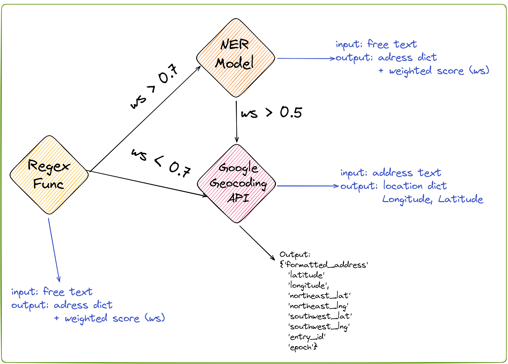

# Address Resolver


## Address Resolver yapısı




Address Resolver fonksiyonunda öncelikle verilen free text halindeki metin regex kontrolüne girer. Regex metindeki çeşitli ifadelerden il, ilçe, mahalle, apartman, daire, telefon no gibi bilgiler çeker ve çektiği bilgilere göre bir weighted score (ws) değeri çıkarır. Eğer Regex tarafından çıkan ws değeri 0.7'den büyükse metinden çıkarılan adres bilgisi Google Geocoding API tarafına yönlendirilir ve adresin nihai koordinat bilgilerine ulaşılır. 

Eğer Regex'ten gelen ws değeri 0.7'den küçükse free text halindeki metin HuggingFace API tarafında servis edilen [Named Entitiy Recognition](https://huggingface.co/deprem-ml/deprem-ner) modeline gönderilir. Bu modelde aynı şekilde free text metindeki entitiyleri bulup bulduğu entitiy sayısına göre bir weighted score değeri döner. Eğer bu ws değeri 0.5'ten büyükse model yine Google Geocoding API tarafına yönlendirilir ve koordinat bilgilerine erişilir. 

Fonksiyonların örnek kullanımları ve çıktıları aşağıda yer almaktadır. 

## Afetharita.com'da Address Resolver


Afetharita.com projesinde ise address-resolver yapısı şu şekilde kurgulanmıştır;

Farklı kaynaklardan gelen veriler API tarafındaki bir consumer vasıtasıyla çeşitli topiclere beslenir. Bu topicler address resolver consumer tarafından sürekli olarak dinlenir. Topiclere veri geldiği anda address resolver veriyi yukarıdaki mantıkla çözümler ve farklı bir topic'e produce eder. 


## Kurulum
```
git clone https://github.com/acikkaynak/deprem-yardim-address-api.git
```

Projenin hatasız şekilde başlaması için requirements.txt'in içerisinde yer alan kütüphanelerin yüklenmesi gerekmektedir.
```
pip install -r requirements.txt
```


## Örnek Kod
Detaylı bilgilere AddressAPI Usage.ipynb dosyasından ulaşabilirsiniz. Örnek kullanım aşağıdaki gibidir.
``` python
from address_resolver import AddressAPI
from dotenv import load_dotenv
import os

load_dotenv('.env')
GOOGLE_API_KEY = os.getenv("GOOGLE_API_KEY")
OPENAI_API_KEY = os.getenv("OPENAI_API_KEY")
NER_API_KEY = os.getenv("NER_API_KEY")

address_api = AddressAPI(GOOGLE_API_KEY, OPENAI_API_KEY, NER_API_KEY)
address_text = 'Hatay ANTAKYA cebrail mah cumhuriyet caddesi seçkinler apt a 3'

print("Regex API")
display(address_api.regex_api_request(address_text, entry_id=1))

print("OpenAI API")
display(address_api.openai_api_request(address_text, entry_id=1))

print("Google Geocode API")
display(address_api.google_geocode_api_request(address_text, entry_id=1))
```


## .env Dosyası
.env dosyanız aşağıdaki ortam değişkenlerini içermelidir.

```
#https://azure.microsoft.com/tr-tr/products/cognitive-services/openai-service/ adresinden alınmış api key
OPENAI_API_KEY=  
#Google Maps API KEY (https://developers.google.com/maps/documentation/geocoding/overview?hl=tr)
GOOGLE_API_KEY= 
#HuggingFace API KEY
NER_API_KEY= 
```

## Örnek Çıktılar
Regex
```
{'city': 'Hatay',
 'distinct': 'ANTAKYA',
 'neighbourhood': 'cebrail mah',
 'excessData': {'street_road': 'cumhuriyet caddesi',
  'complex': '',
  'apartment': 'seçkinler apt',
  'part': '',
  'block': '',
  'floor': '',
  'apartment_no': '',
  'phone': ''},
 'originalText': 'Hatay ANTAKYA cebrail mah cumhuriyet caddesi seçkinler apt a 3',
 'address': 'Hatay ANTAKYA cebrail mah cumhuriyet caddesi seçkinler apt',
 'ws': 0.7142857142857143,
 'entry_id': 1}
```

Named Entity Recognition
```
{'city': 'Hatay',
 'distinct': 'Antakya',
 'neighbourhood': 'Cebrail Mahallesi',
 'street': 'Cumhuriyet Caddesi',
 'no': '3',
 'tel': '',
 'name_surname': '',
 'address': 'Antakya, Cebrail Mahallesi, Cumhuriyet Caddesi, Seçkinler Apt. No:3',
 'entry_id': 1}
```

Google Geocoding API
```
{'address': 'Hatay ANTAKYA cebrail mah cumhuriyet caddesi seçkinler apt a 3',
 'latitude': 36.2033813,
 'longitude': 36.1588396,
 'northeast_lat': 36.20469882989271,
 'northeast_lng': 36.16017122989272,
 'southwest_lat': 36.20199917010727,
 'southwest_lng': 36.15747157010728,
 'formatted_address': 'Cebrail Mah.Cumhuriyet Cad.Seçkinler Apt Altı, No:10/4, 31040 Antakya/Hatay, Türkiye',
 'is_resolved': True,
 'entry_id': 1}
```

